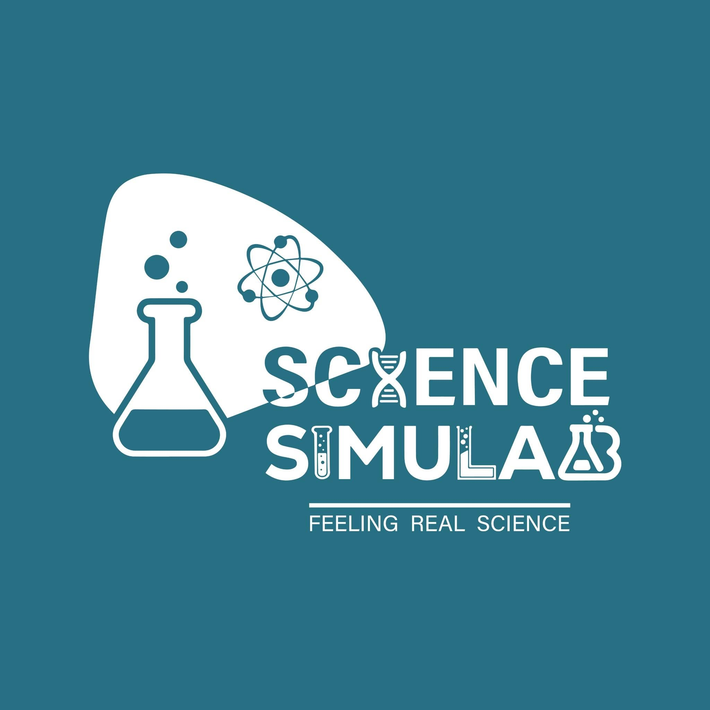

<div align="center">



# Science Simulab

### Feeling Real Science

**Interactive Mathematics & Science learning through simulation, visualisation and exploration.**

</div>

---

## 🔬 Who We Are

**Science Simulab** is an educational technology initiative focused on transforming traditional Mathematics and Science learning into interactive digital experiences.

We are building a simulation-based learning platform where students can **explore concepts, manipulate variables, conduct virtual experiments and observe results in real time** rather than relying only on static textbook diagrams.

Our primary learning platform is being developed around the **Bangladesh National Curriculum and Textbook Board (NCTB) curriculum for Classes 3–8**.

> **Our goal is simple: make difficult concepts easier to understand by allowing students to see, explore and experience them.**

---

## 🎯 What We Are Building

Science Simulab combines curriculum-based learning with interactive technology to create educational experiences across:

🧮 **Mathematics**  
🔭 **Physics**  
🧪 **Chemistry**  
🧬 **Biology**  
🌍 **Environmental Science**  
⚡ **Energy & Electricity**  
🌌 **Astronomy**  
📊 **Data & Measurement**

Students interact with simulations using controls such as sliders, draggable objects, experiments, graphs, animations, measurements and interactive scientific models.

---

## 📚 Curriculum Coverage

Our current development focuses on:

| Level | Mathematics | Science |
| :---: | :---: | :---: |
| Class 3 | ✅ | ✅ |
| Class 4 | ✅ | ✅ |
| Class 5 | ✅ | ✅ |
| Class 6 | ✅ | ✅ |
| Class 7 | ✅ | ✅ |
| Class 8 | ✅ | ✅ |

The simulations are designed around concepts identified from the corresponding **NCTB textbooks and curriculum**.

---

## 🧪 Learning Through Interaction

Science Simulab follows an exploration-based learning approach:

```text
Explore → Interact → Observe → Understand → Apply
